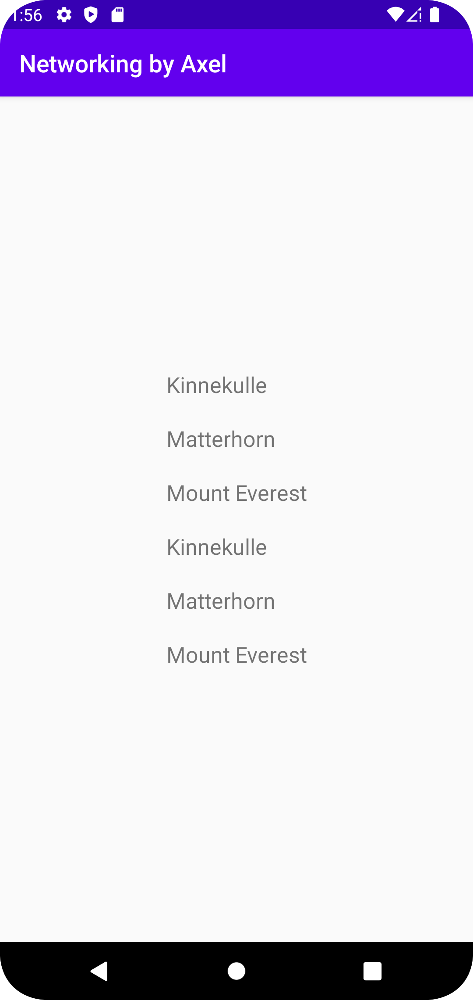

# Rapport

**Skriv din rapport här!**
Syftet med uppgiften var att skapa en recyclerview som skulle redovisa ett antal berg. Det första som gjordes var att 
byta ut textview elementet i activity_main.xml mot ett recyclerview element. Efter ändringen i activity_main.xml
gjorts skapades Mountain klassen som används för att tolka json datan. Arrayen mountains skapades även i filen MainActivity.java
genom koden:
private final ArrayList<Mountain> mountains = new ArrayList<>();
Efter att arrayen skapats uppstod lite problem med att skapa en adapter. För mycket olik kod inspirerad från internet
ledde till att adaptern inte fungerade och var väldigt svår att förstå. Detta problem löstes genom att följa instruktionerna på denna länk:
https://dugga.iit.his.se/DuggaSys/showdoc.php?exampleid=it351g_widgets_recyclerview.md&courseid=1&coursevers=928742&fname=it351g_widgets_recyclerview.md
Efter att ha gjort om i filerna samt gjort om hela MyAdapter filen blev det lättare att förstå vad som skulle göras härnäst.
Pågrund av datorns brandvägg gick det tyvärr ej att nå JSON_URL vilket löstes genom att hänvisa till JSON_FILE istället genom koden:
private final String JSON_FILE = "mountains.json";
Denna fil kunde sedan laddas ner genom flöjande kod:
private void getJson() {
    new JsonFile(this, this).execute(JSON_FILE);
}
Genom följande kod kunde sedan datan från JSON filen sparas till variabler som sedan användas för att skapa en ny instans av mountain klassen
och lägga till den i arrayen mountains som tidigare skapats:
for (int i = 0; i < jsonArray.length(); i++) {
    JSONObject jsonObject = jsonArray.getJSONObject(i);
    String id = jsonObject.getString("ID");
    String name = jsonObject.getString("name");
    String type = jsonObject.getString("type");
    String location = jsonObject.getString("location");
    int size = jsonObject.getInt("size");
    int cost = jsonObject.getInt("cost");
    JSONObject auxData = jsonObject.getJSONObject("auxdata");
    String wiki = auxData.getString("wiki");
    String imgUrl = auxData.optString("img", "");
    Mountain mountain = new Mountain(id, name, type, location, size, cost, wiki, imgUrl);
    mountains.add(mountain);
}
Genom denna kod tilldelas adaptern en layout fil och mountains arrayen som är kopplad till andra änden av adaptern
visas upp på skärmen:
RecyclerView view = findViewById(R.id.recyclerview1);
view.setLayoutManager(new LinearLayoutManager(this));
view.setAdapter(adapter);
getJson();


Nedan är en skärmbild på hur appen ser ut:

## Följande grundsyn gäller dugga-svar:

- Ett kortfattat svar är att föredra. Svar som är längre än en sida text (skärmdumpar och programkod exkluderat) är onödigt långt.
- Svaret skall ha minst en snutt programkod.
- Svaret skall inkludera en kort övergripande förklarande text som redogör för vad respektive snutt programkod gör eller som svarar på annan teorifråga.
- Svaret skall ha minst en skärmdump. Skärmdumpar skall illustrera exekvering av relevant programkod. Eventuell text i skärmdumpar måste vara läsbar.
- I de fall detta efterfrågas, dela upp delar av ditt svar i för- och nackdelar. Dina för- respektive nackdelar skall vara i form av punktlistor med kortare stycken (3-4 meningar).

Programkod ska se ut som exemplet nedan. Koden måste vara korrekt indenterad då den blir lättare att läsa vilket gör det lättare att hitta syntaktiska fel.

```
function errorCallback(error) {
    switch(error.code) {
        case error.PERMISSION_DENIED:
            // Geolocation API stöds inte, gör något
            break;
        case error.POSITION_UNAVAILABLE:
            // Misslyckat positionsanrop, gör något
            break;
        case error.UNKNOWN_ERROR:
            // Okänt fel, gör något
            break;
    }
}
```

Bilder läggs i samma mapp som markdown-filen.


Läs gärna:

- Boulos, M.N.K., Warren, J., Gong, J. & Yue, P. (2010) Web GIS in practice VIII: HTML5 and the canvas element for interactive online mapping. International journal of health geographics 9, 14. Shin, Y. &
- Wunsche, B.C. (2013) A smartphone-based golf simulation exercise game for supporting arthritis patients. 2013 28th International Conference of Image and Vision Computing New Zealand (IVCNZ), IEEE, pp. 459–464.
- Wohlin, C., Runeson, P., Höst, M., Ohlsson, M.C., Regnell, B., Wesslén, A. (2012) Experimentation in Software Engineering, Berlin, Heidelberg: Springer Berlin Heidelberg.
